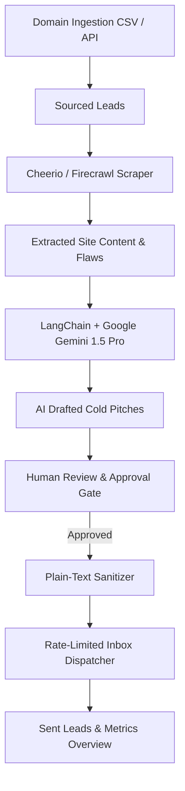

# 🚀 Autonomous B2B Lead Generation & Outreach Engine

An autonomous, queue-driven B2B lead generation, website scraping, AI hyper-personalization, and rate-limited email outreach platform featuring an industrial dark-mode user dashboard.


---

## 🌟 Key Features

* **⚡ 4-Phase Autonomous Pipeline:**
  1. **Ingestion & Targeting:** Ingest prospect domains via CSV upload or API endpoints (`/api/ingest`).
  2. **Out-of-Band Scraping:** Extract homepage content and identify visual, technical, and conversion flaws using Firecrawl API or built-in Cheerio fallback.
  3. **AI Hyper-Personalization:** 2-pass LangChain pipeline using **Google Gemini 1.5 Pro** (or GPT-4o) to draft evidence-backed cold emails tailored to observed site flaws and your custom service offerings.
  4. **Deliverability Protection:** Multi-inbox load balancing, strict 40 emails/day per inbox rate limits, and 100% plain-text email enforcement to bypass spam filters.
* **🎛️ Industrial Dark-Mode User Dashboard:**
  * **Command Center (`/`):** Live metrics overview (scraped count, draft volume, emails sent, active inboxes) and real-time pipeline activity stream.
  * **Lead Pipeline Kanban (`/pipeline`):** Drag-and-drop Kanban board visualizing leads across states (`Sourced` → `Scraped` → `AI Drafted` → `Approved` → `Sent` → `Replied`).
  * **Human-in-the-Loop Approval Queue (`/approval`):** Side-by-side inspection view allowing manual editing and review before queueing dispatches.
  * **Campaign & Inbox Settings (`/settings`):** SMTP inbox credentials management and customizable AI service positioning context.

---

## 🏗️ Architecture & Pipeline Flow



---

## 🛠️ Tech Stack

* **Frontend:** Next.js 14 (App Router), React 18, Tailwind CSS, Framer Motion, Lucide React icons.
* **Backend & Automation:** Node.js, Prisma ORM, SQLite / PostgreSQL, BullMQ, ioredis.
* **AI Engine:** LangChain (`@langchain/google-genai`, `@langchain/openai`), Google Gemini 1.5 Pro.
* **Dispatch & Mailer:** Nodemailer SMTP, Resend API integration support.

---

## 🚀 Quickstart Guide

### 1. Prerequisites
* Node.js v18+ installed
* npm package manager

### 2. Installation
Clone the repository and install dependencies:
```bash
git clone https://github.com/whiteki3011s/automated-email.git
cd automated-email
npm install
```

### 3. Environment Setup (`.env`)
Create `.env` and `.env.local` files in the project root:
```bash
# Database Connection (Zero-setup local SQLite)
DATABASE_URL="file:./dev.db"

# Redis Cache & Job Queues
REDIS_URL="redis://localhost:6379"

# AI Reasoning - Google Gemini (via LangChain @langchain/google-genai)
GOOGLE_API_KEY="your_google_gemini_api_key"

# Environment
NODE_ENV="development"
```

### 4. Database Initialization
Synchronize database schema with Prisma:
```bash
npx prisma db push
```

### 5. Launch Development Server
```bash
npm run dev
```
Open **[`http://localhost:3000`](http://localhost:3000)** in your browser.

---

## 📖 Step-by-Step Usage Guide

1. **Configure Service Offering:** Go to **Settings** (`/settings`) and enter the services you provide (e.g. *"Modern UI/UX redesign & PageSpeed optimization"*). Click **Save Service Context**.
2. **Ingest Target Domains:** Go to **Lead Pipeline** (`/pipeline`) and enter prospect domain names (e.g. `stripe.com, vercel.com`).
3. **Run Automation:** Click **"Run Engine Automation"** in the top right header to execute website scraping, flaw analysis, and Gemini AI draft generation.
4. **Approve Drafts:** Go to **Draft Approval** (`/approval`) to review, edit, and approve generated pitches.
5. **Track Sent Emails:** View sent email progress on the **Sent** Kanban column and the **Command Center** dashboard metrics!

---

## 🔒 Security & Privacy

* `.env`, `.env.local`, and SQLite database files (`*.db`) are strictly excluded by `.gitignore` to prevent credential leakage.
* SMTP credentials and API keys are stored securely on the server side.

---

## 📜 License

MIT License. Designed and built with Google Antigravity & Spec-Kit.
