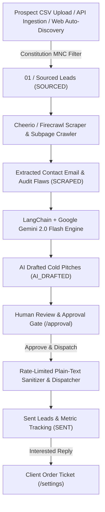

# 🚀 Autonomous B2B Lead Generation & Outreach Engine

An autonomous, queue-driven B2B lead generation, live website scraping, real contact email extraction, AI hyper-personalization, and rate-limited plain-text email outreach platform featuring an industrial operations dashboard.


---

## 🌟 Key Features

* **⚡ 4-Stage Autonomous Pipeline:**
  1. **01 / Sourcing (`SOURCED`):** Ingest prospect domains via CSV upload, form input, or live web auto-discovery (`/api/ingest`). Enforces Constitution Rules to exclude multinational corporations, enterprise conglomerates, and Fortune 500 companies before scraping.
  2. **02 / Qualifying & Out-of-Band Scraping (`SCRAPED`):** Extract website markdown, `mailto:` links, text regex, and crawl `/contact` & `/about` subpages to discover real business contact emails. Identifies mobile responsiveness defects, missing H1 tags, non-SSL issues, and CTA conversion bottlenecks using built-in Cheerio or Firecrawl API.
  3. **03 / AI Hyper-Personalization (`AI_DRAFTED`):** 2-pass LangChain pipeline using **Google Gemini 2.0 Flash** (`gemini-2.0-flash`) or GPT-4o to generate personalized, 100% plain-text cold emails grounded strictly in observed audit flaws and custom service offerings.
  4. **04 / Deliverability Protection & Human Dispatch (`SENT`):** Review queue with evidence panels, preflight checks, inline text editing, multi-inbox load balancing, and strict 40 emails/day per inbox rate limits via Nodemailer SMTP / Resend API.
* **🎛️ Operations Control Dashboard:**
  * **Command Center (`/`):** Real-time KPI metrics overview (sourced today, qualified count, draft volume, emails sent, pending client orders) and worker queue status.
  * **Lead Pipeline Kanban (`/pipeline`):** Stage-by-stage Kanban board with dedicated internal scroll containers (`max-h-[560px]`) displaying real database leads (`Sourced` → `Qualifying` → `Awaiting approval` → `Contacted`) and an Exclusion Ledger.
  * **Human-in-the-Loop Review Queue (`/approval`):** Inspection workspace (`max-h-[540px]`), evidence audit panels, preflight safeguards, and 1-click SMTP email dispatching.
  * **Campaign & Inbox Settings (`/settings`):** SMTP inbox credentials management, 40 email/day hard cap load balancing, and client order tickets automatically created from positive intent replies.

---

## 🏗️ Architecture & Pipeline Flow



---

## 🛠️ Tech Stack

* **Frontend:** Next.js 14 (App Router), React 18, Tailwind CSS, Lucide React icons.
* **Backend & Queues:** Node.js, Prisma ORM, SQLite (`prisma/dev.db`) / PostgreSQL, BullMQ (`ioredis`).
* **AI Engine:** LangChain (`@langchain/google-genai`, `@langchain/openai`), Google Gemini 2.0 Flash (`gemini-2.0-flash`).
* **Scraper & Dispatcher:** Cheerio HTML Parser, Firecrawl API support, Nodemailer SMTP, Resend API integration.

---

## 🚀 Quickstart Guide

### 1. Prerequisites
* Node.js v18+ installed
* npm package manager
* (Optional) Redis server for BullMQ background workers (`redis://localhost:6379`)

### 2. Installation
Clone the repository and install dependencies:
```bash
git clone https://github.com/whiteki3011s/automated-email.git
cd automated-email
npm install
```

### 3. Environment Setup (`.env.local`)
Create `.env.local` in the project root:
```bash
# Database Connection (Zero-setup local SQLite)
DATABASE_URL="file:./prisma/dev.db"

# Redis Cache & Job Queues (Optional for background worker queues)
REDIS_URL="redis://localhost:6379"

# AI Reasoning - Google Gemini (via LangChain @langchain/google-genai)
GOOGLE_API_KEY="your_google_gemini_api_key"

# (Optional) Firecrawl API Key for enhanced scraping
FIRECRAWL_API_KEY="your_firecrawl_api_key"

# Environment
NODE_ENV="development"
```

### 4. Database Initialization
Synchronize database schema with Prisma:
```bash
npx prisma db push
```

### 5. Launch Development Server
```bash
npm run dev
```
Open **[`http://localhost:3000`](http://localhost:3000)** in your browser.

---

## 📖 Step-by-Step Usage Guide

1. **Configure Service Context & Inboxes:** Go to **Settings** (`/settings`), configure your service context (e.g. *"Modern UI/UX redesign & PageSpeed optimization"*), and connect your SMTP sending inbox credentials.
2. **Auto-Source or Ingest Target SMB Domains:** Go to **Lead Pipeline** (`/pipeline`) or **Command Center** (`/`) and click **"Auto-source SMBs"** or click **"Source leads"** to submit custom domains or upload CSV files. They will immediately populate the **Sourced** column.
3. **Run Autonomous Engine:** Click **"Run autonomous engine"** to scrape target websites, extract real contact emails, audit site flaws, and generate Gemini 2.0 Flash cold pitch drafts. Leads will transition step-by-step from **Sourced** to **Qualifying** and **Awaiting approval**.
4. **Approve & Dispatch Pitches:** Go to **Draft Approvals** (`/approval`), review the observed site audit findings, edit pitch text if desired, and click **Approve & dispatch email**. The system immediately dispatches the plain-text email via SMTP and sets lead/email status to `SENT`.
5. **Track Fulfillments:** View incoming client order tickets automatically created from interested replies under **Settings & Orders** (`/settings`).

---

## 🔒 Security & Privacy

* `.env`, `.env.local`, and SQLite database files (`*.db`) are strictly excluded by `.gitignore` to prevent credential leakage.
* SMTP credentials and API keys are stored securely on the server side.

---

## 📜 License

MIT License. Designed and built with Google Antigravity & Spec-Kit.
