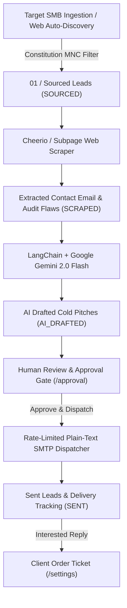

# 🚀 Autonomous B2B Lead Generation & Outreach Engine

An autonomous, evidence-grounded B2B lead generation, live website scraping, real contact email extraction, AI hyper-personalization, and rate-limited plain-text outreach platform featuring a modern high-contrast operations control dashboard.


---

## 🌟 Key Features

* **⚡ 4-Stage Autonomous Pipeline:**
  1. **01 / Sourcing (`SOURCED`):** Auto-discover target SMB business domains via DuckDuckGo & Bing web search or custom domain input (`/api/ingest`). Filters out MNCs, enterprise conglomerates, and Fortune 500 companies via Constitution rules.
  2. **02 / Qualifying & Scraping (`SCRAPED`):** Crawl target website HTML, `mailto:` links, text regex, and subpages (`/contact`, `/about`) to discover real contact emails. Detects mobile layout defects, missing H1 tags, non-SSL issues, and hero CTA conversion bottlenecks.
  3. **03 / AI Hyper-Personalization (`AI_DRAFTED`):** 2-pass LangChain pipeline leveraging **Google Gemini 2.0 Flash** (`gemini-2.0-flash`) or GPT-4o to draft personalized, 100% plain-text cold pitches grounded strictly in observed audit evidence.
  4. **04 / Human Review & Dispatch (`SENT`):** Review queue with evidence panels, inline subject/body editing, and instant rate-limited plain-text email dispatch via Nodemailer SMTP.
* **🎛️ Operations Control Dashboard:**
  * **Command Center (`/`):** Real-time KPI metrics (sourced, qualified, draft volume, emails sent, pending client orders) and operational worker queue status.
  * **Lead Pipeline Kanban (`/pipeline`):** Stage-by-stage Kanban board with permanently collapsed internal scroll containers (`max-h-[560px]`) displaying real database leads (`Sourced` → `Qualifying` → `Awaiting approval` → `Contacted`) and an Exclusion Ledger.
  * **Human-in-the-Loop Review Queue (`/approval`):** Side-by-side inspection view with internal scroll (`max-h-[540px]`), evidence audit panels, preflight safety checks, and 1-click SMTP email dispatching.
  * **Campaign & Inbox Settings (`/settings`):** Connected SMTP inbox credentials management, 40 email/day hard cap load balancing, and client order tickets created from positive intent replies.

---

## 🏗️ Architecture & Pipeline Flow



---

## 🛠️ Tech Stack

* **Frontend:** Next.js 14 (App Router), React 18, Tailwind CSS, Lucide React icons.
* **Backend & Database:** Node.js, Prisma ORM, SQLite (`prisma/dev.db`) / PostgreSQL, BullMQ.
* **AI Engine:** LangChain (`@langchain/google-genai`, `@langchain/openai`), Google Gemini 2.0 Flash (`gemini-2.0-flash`).
* **Scraper & Mailer:** Cheerio HTML Parser, Nodemailer SMTP, Mailtrap support.

---

## 🚀 Quickstart Guide

### 1. Prerequisites
* Node.js v18+ installed
* npm package manager

### 2. Installation
Clone the repository and install dependencies:
```bash
git clone https://github.com/whiteki3011s/automated-email.git
cd automated-email
npm install
```

### 3. Environment Setup (`.env.local`)
Create `.env.local` in the project root:
```bash
# Database Connection (Zero-setup local SQLite)
DATABASE_URL="file:./prisma/dev.db"

# AI Reasoning - Google Gemini (via LangChain @langchain/google-genai)
GOOGLE_API_KEY="your_google_gemini_api_key"

# Environment
NODE_ENV="development"
```

### 4. Database Initialization
Synchronize database schema with Prisma:
```bash
npx prisma db push
```

### 5. Launch Development Server
```bash
npm run dev
```
Open **[`http://localhost:3000`](http://localhost:3000)** in your browser.

---

## 📖 Step-by-Step Usage Guide

1. **Auto-Source or Submit SMB Domains:** On the **Lead Pipeline** (`/pipeline`) or **Command Center** (`/`), click **"Auto-source SMBs"** or click **"Source leads"** to submit custom target SMB domains. They will immediately populate the **Sourced** column.
2. **Run Autonomous Engine:** Click **"Run autonomous engine"** to scrape target websites, extract real contact emails, audit site flaws, and generate Gemini 2.0 Flash cold pitch drafts. Leads will transition step-by-step to **Qualifying** and **Awaiting approval**.
3. **Approve & Dispatch Emails:** Go to **Draft Approvals** (`/approval`), review the observed site audit findings, edit pitch text if desired, and click **Approve & dispatch email**. The system immediately dispatches the plain-text email via SMTP and sets lead/email status to `SENT`.
4. **Fulfill Orders:** View incoming client order tickets automatically created from interested replies under **Settings & Orders** (`/settings`).

---

## 🔒 Security & Privacy

* `.env`, `.env.local`, and SQLite database files (`*.db`) are strictly excluded by `.gitignore` to prevent credential leakage.
* SMTP credentials and API keys are stored securely on the server side.

---

## 📜 License

MIT License. Designed and built with Google Antigravity.
