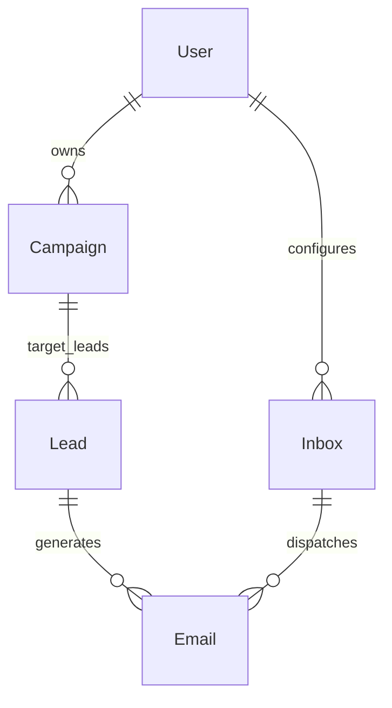
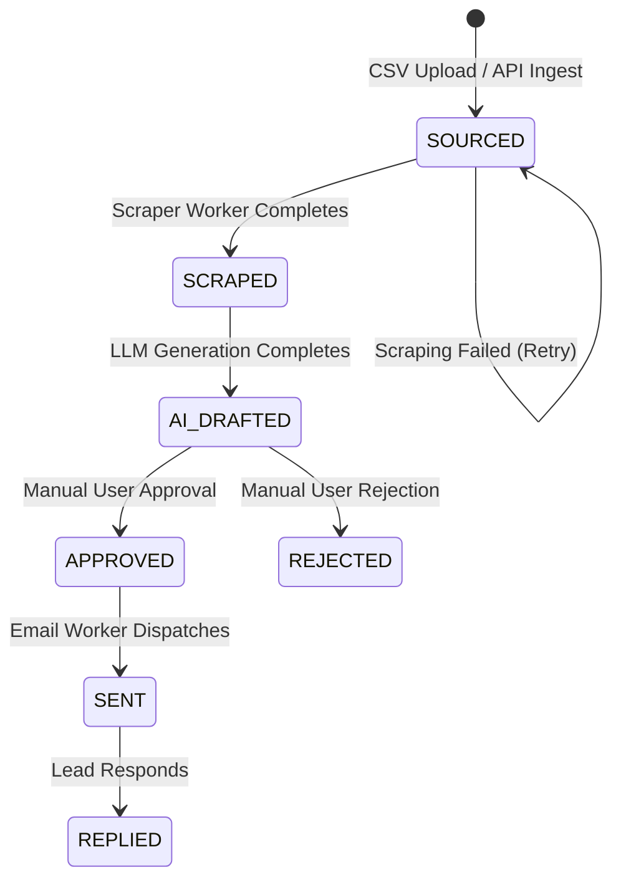
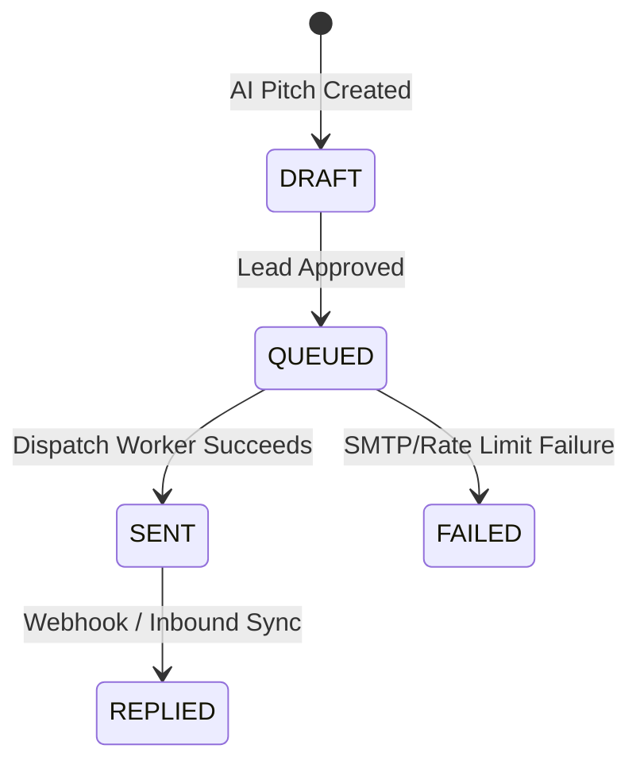

# Data Model Specification: Autonomous B2B Lead Generation & Outreach Engine

**Feature**: [`specs/001-b2b-outreach-engine/spec.md`](file:///Users/abhaysharma/all_codes/outreach/specs/001-b2b-outreach-engine/spec.md)
**Date**: 2026-10-03

## Entity Relationship & Schema Overview

## Entities & Field Definitions

### 1. `User`
Represents an administrative outreach operator using the dashboard.
* `id`: String (CUID, Primary Key)
* `email`: String (Unique, required)
* `name`: String (Optional)
* `createdAt`: DateTime
* `updatedAt`: DateTime

### 2. `Inbox`
Represents a connected sending email inbox with SMTP configuration and daily rate limit counters.
* `id`: String (CUID, Primary Key)
* `userId`: String (Foreign Key -> User.id)
* `senderName`: String (Display name, e.g. "Abhay Sharma")
* `fromEmail`: String (Unique email address, e.g. "abhay@outreach.io")
* `smtpHost`: String (SMTP host, e.g. "smtp.gmail.com")
* `smtpPort`: Int (Port, e.g. 587 or 465)
* `smtpUser`: String (SMTP username)
* `smtpPass`: String (Encrypted password/token)
* `dailyLimit`: Int (Default: 40)
* `sentTodayCount`: Int (Default: 0, resets every 24h)
* `lastSentAt`: DateTime (Optional)
* `status`: `InboxStatus` (`ACTIVE`, `PAUSED`, `RATE_LIMITED`)
* `createdAt`: DateTime
* `updatedAt`: DateTime

### 3. `Campaign`
Represents an outreach initiative targeting specific domains with specific service context.
* `id`: String (CUID, Primary Key)
* `userId`: String (Foreign Key -> User.id)
* `name`: String (Campaign name, e.g. "SaaS Redesign Pitch Q4")
* `serviceContext`: Text (Context describing services offered, e.g. "Modern UI/UX design & Next.js performance optimization")
* `status`: `CampaignStatus` (`DRAFT`, `ACTIVE`, `PAUSED`, `COMPLETED`)
* `createdAt`: DateTime
* `updatedAt`: DateTime

### 4. `Lead`
Represents a target company domain undergoing scraping, flaw analysis, and outreach.
* `id`: String (CUID, Primary Key)
* `campaignId`: String (Foreign Key -> Campaign.id)
* `domain`: String (Domain name, e.g. "acme.com")
* `companyName`: String (Optional)
* `contactEmail`: String (Optional extracted contact email)
* `scrapedContent`: Text (Extracted website text/markdown)
* `flawsFound`: JSON (Array of identified technical/UI flaw strings)
* `status`: `LeadStatus` (`SOURCED`, `SCRAPED`, `AI_DRAFTED`, `APPROVED`, `SENT`, `REPLIED`, `REJECTED`)
* `createdAt`: DateTime
* `updatedAt`: DateTime

### 5. `Email`
Represents an outreach email generated by AI and queued/sent to a lead.
* `id`: String (CUID, Primary Key)
* `leadId`: String (Foreign Key -> Lead.id)
* `inboxId`: String (Optional Foreign Key -> Inbox.id)
* `subject`: String (Email subject line)
* `bodyText`: Text (Strictly plain-text email body content)
* `status`: `EmailStatus` (`DRAFT`, `QUEUED`, `SENT`, `FAILED`, `REPLIED`)
* `sentAt`: DateTime (Optional timestamp when sent)
* `errorMessage`: Text (Optional error details if failed)
* `createdAt`: DateTime
* `updatedAt`: DateTime

---

## State Transition Machines

### Lead Lifecycle State (`LeadStatus`)

### Email Lifecycle State (`EmailStatus`)

---

## Validation & Business Rules

1. **Daily Rate Limit Rule**: `sentTodayCount` on an `Inbox` MUST NOT exceed `dailyLimit` (40) in any rolling 24-hour window.
2. **Plain-Text Formatting Rule**: `bodyText` in `Email` MUST pass plain-text sanitization check (`/<[^>]*>/g` HTML tags forbidden).
3. **Approval Gate Rule**: An `Email` record MUST NOT transition to `QUEUED` until `Lead.status` is explicitly set to `APPROVED`.
