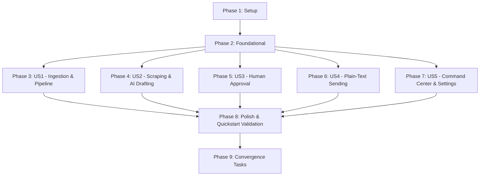

# Tasks: Autonomous B2B Lead Generation & Outreach Engine

**Feature**: [`specs/001-b2b-outreach-engine/spec.md`](file:///Users/abhaysharma/all_codes/outreach/specs/001-b2b-outreach-engine/spec.md)
**Branch**: `001-b2b-outreach-engine`
**Date**: 2026-10-03

---

## Phase 1: Setup (Shared Infrastructure)

**Purpose**: Project initialization, package dependencies, and styling configuration

- [X] T001 Initialize Next.js 14 App Router project dependencies in `package.json`
- [X] T002 [P] Configure industrial dark-mode theme tokens (`#09090b` obsidian background, liquid silver, stark red accents) in `src/styles/globals.css` and `tailwind.config.js`
- [X] T003 [P] Setup environment configuration manager and Zod validation in `src/lib/env.ts`

---

## Phase 2: Foundational (Blocking Prerequisites)

**Purpose**: Core infrastructure that MUST be complete before ANY user story can be implemented

- [X] T004 Setup Prisma schema with models `User`, `Inbox`, `Campaign`, `Lead`, `Email` and enum constraints in `prisma/schema.prisma`
- [X] T005 [P] Create Prisma Client singleton instance in `src/lib/prisma.ts`
- [X] T006 [P] Setup Redis connection and BullMQ queue instances in `src/lib/queue/client.ts`
- [X] T007 Create reusable Obsidian Glassmorphic UI components (`GlassPanel`, `Badge`, `Button`, `StatCard`) in `src/components/ui/GlassPanel.tsx`
- [X] T008 [P] Implement main application layout with Sidebar and Header navigation in `src/components/layout/Sidebar.tsx` and `src/components/layout/Header.tsx`

**Checkpoint**: Foundation ready — user story implementation can now begin

---

## Phase 3: User Story 1 - Target Domain Ingestion & Pipeline Tracking (Priority: P1) 🎯 MVP

**Goal**: Upload target domains via CSV or API and visualize leads moving across Kanban board states (`SOURCED`, `SCRAPED`, `AI_DRAFTED`, `APPROVED`, `SENT`, `REPLIED`).

**Independent Test**: Ingest 5 domains via `/api/ingest` and verify they render under `Sourced` on `/pipeline` page.

- [X] T009 [P] [US1] Create domain ingestion API route supporting CSV and JSON payloads in `src/app/api/ingest/route.ts`
- [X] T010 [P] [US1] Create lead list and status update API route in `src/app/api/leads/route.ts`
- [X] T011 [US1] Create LeadCard component in `src/components/pipeline/LeadCard.tsx`
- [X] T012 [US1] Create KanbanBoard component with Framer Motion transitions in `src/components/pipeline/KanbanBoard.tsx`
- [X] T013 [US1] Create Lead Pipeline page layout and state hook in `src/app/pipeline/page.tsx`

**Checkpoint**: User Story 1 fully functional and testable independently (MVP ready!)

---

## Phase 4: User Story 2 - Automated Scraping & Flaw-Based AI Pitch Generation (Priority: P1)

**Goal**: Scrape target website homepage text out-of-band, extract technical/design flaws via LLM, and draft plain-text cold pitches.

**Independent Test**: Trigger scraping & AI worker for a lead, verify `flawsFound` JSON and AI plain-text draft generated.

- [X] T014 [P] [US2] Implement web scraper module (Firecrawl API with Cheerio fallback) in `src/lib/scraping/scraper.ts`
- [X] T015 [P] [US2] Implement LangChain LLM 2-pass flaw extraction and email pitch generator in `src/lib/ai/generator.ts` and `src/lib/ai/prompts.ts`
- [X] T016 [US2] Implement BullMQ `scrape-lead-queue` worker in `src/lib/queue/scrapingWorker.ts`
- [X] T017 [US2] Implement BullMQ `ai-draft-queue` worker in `src/lib/queue/aiWorker.ts`
- [X] T018 [US2] Implement pipeline trigger API route (`/api/pipeline/trigger`) in `src/app/api/pipeline/trigger/route.ts`

**Checkpoint**: User Story 1 AND 2 working independently

---

## Phase 5: User Story 3 - Human Draft Review & Approval Interface (Priority: P1)

**Goal**: Review, edit, approve, or reject AI-generated drafts before dispatch queueing.

**Independent Test**: Select an AI-drafted email, edit subject/body text, click "Approve", verify status updates to `APPROVED` and email record to `QUEUED`.

- [X] T019 [P] [US3] Create draft approval API route (`/api/drafts/[id]`) in `src/app/api/drafts/[id]/route.ts`
- [X] T020 [US3] Create DraftEditor component displaying side-by-side site flaws and plain-text editor in `src/components/approval/DraftEditor.tsx`
- [X] T021 [US3] Create Approval interface page layout in `src/app/approval/page.tsx`

**Checkpoint**: Draft approval gate active and preventing unauthorized sending

---

## Phase 6: User Story 4 - Multi-Inbox Rate-Limited Plain-Text Email Dispatch (Priority: P1)

**Goal**: Load-balance approved emails across active sender inboxes, enforce 40 emails/day hard limit per inbox, and dispatch plain-text emails.

**Independent Test**: Approve 5 emails across 2 inboxes, verify dispatches, rate-limit counters, and 100% plain-text body formatting.

- [X] T022 [P] [US4] Implement plain-text sanitation filter and Nodemailer/Resend transport wrapper in `src/lib/mailer/sender.ts`
- [X] T023 [US4] Implement BullMQ `dispatch-email-queue` worker with Redis 24h rate counters in `src/lib/queue/sendingWorker.ts`

**Checkpoint**: Rate-limited plain-text sending engine fully functional

---

## Phase 7: User Story 5 - Command Center Analytics & Inbox Configuration (Priority: P2)

**Goal**: High-level metrics view (sent, scraped, open/reply rates) and SMTP inbox credentials management.

**Independent Test**: Connect new SMTP inbox credentials via `/api/settings/inbox`, update service positioning context, and view updated metrics on `/`.

- [X] T024 [P] [US5] Create inbox settings API route (`/api/settings/inbox`) in `src/app/api/settings/inbox/route.ts`
- [X] T025 [US5] Create MetricsOverview and ActivityFeed components in `src/components/dashboard/MetricsOverview.tsx` and `src/components/dashboard/ActivityFeed.tsx`
- [X] T026 [US5] Create Command Center home page layout in `src/app/page.tsx`
- [X] T027 [US5] Create Campaign & Inbox Settings page layout in `src/app/settings/page.tsx`

---

## Phase 8: Polish & Cross-Cutting Concerns

**Purpose**: System hardening and validation

- [X] T028 Run end-to-end quickstart validation scenario from `specs/001-b2b-outreach-engine/quickstart.md`
- [X] T029 Add error boundary handling and empty state fallbacks across dashboard pages

---

## Dependencies & Execution Order

---

## Phase 9: Convergence

**Purpose**: Remediate gaps between Constitution v1.2.0 principles and current implementation

- [X] T030 Implement MNC and Enterprise exclusion filtering heuristic per Constitution IV (missing)
- [X] T031 Implement social media and web directory lead scraper adapters (Instagram, LinkedIn, Google Maps) per Constitution IV (missing)
- [X] T032 Implement automated daily cron sourcing worker for 100-200 SMB prospects per Constitution IV (missing)
- [X] T033 Implement Need-Based Qualification Gate in pipeline worker to reject leads without verifiable service flaws per Constitution IV (missing)
- [X] T034 Implement LLM response intent classifier and automated order creation for positive lead replies per Constitution VI (missing)

